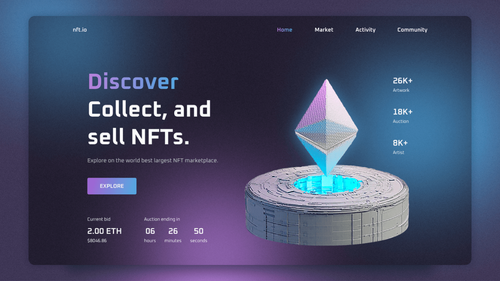

# NFT Website

The project features smooth CSS styling and ScrollReveal animations, developed with a mobile-first approach before scaling up for desktop. It delivers a polished, user-friendly interface for an engaging browsing experience.

**Live Website:** [https://kethnulee-weerasinghe.github.io/NFT-Website/](https://kethnulee-weerasinghe.github.io/NFT-Website/)



## Overview

This project showcases a modern landing page design for an NFT-related product or platform. It is built to highlight featured content, calls to action, and brand messaging with visual appeal and responsive behavior.

- Smooth scroll-based animations using ScrollReveal
- Animated navigation and interactive UI elements
- Mobile-first responsive layout
- Clean and minimal visual design
- Optimized for performance and accessibility

## Technologies Used

- HTML
- CSS
- JavaScript

## Running the Project Locally

To run this project on your local machine:

```bash
git clone https://github.com/Kethnulee-Weerasinghe/NFT-Website.git
cd NFT-Website
